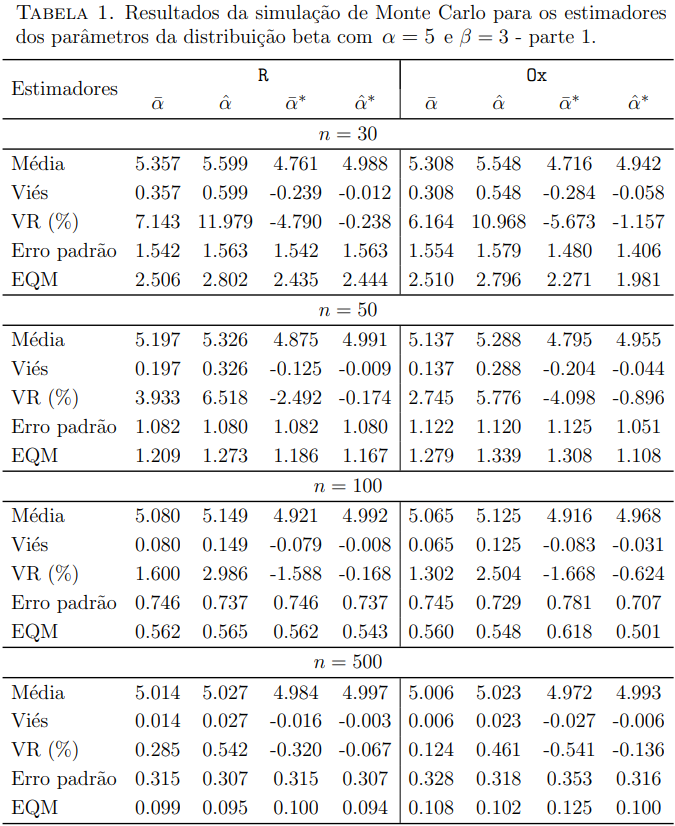
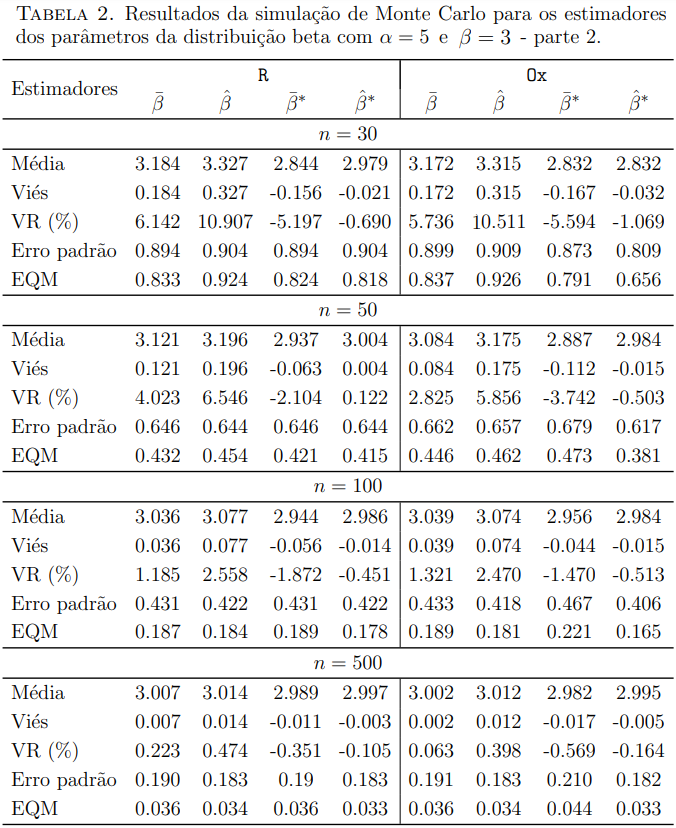
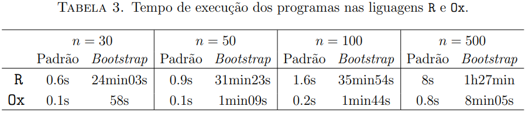
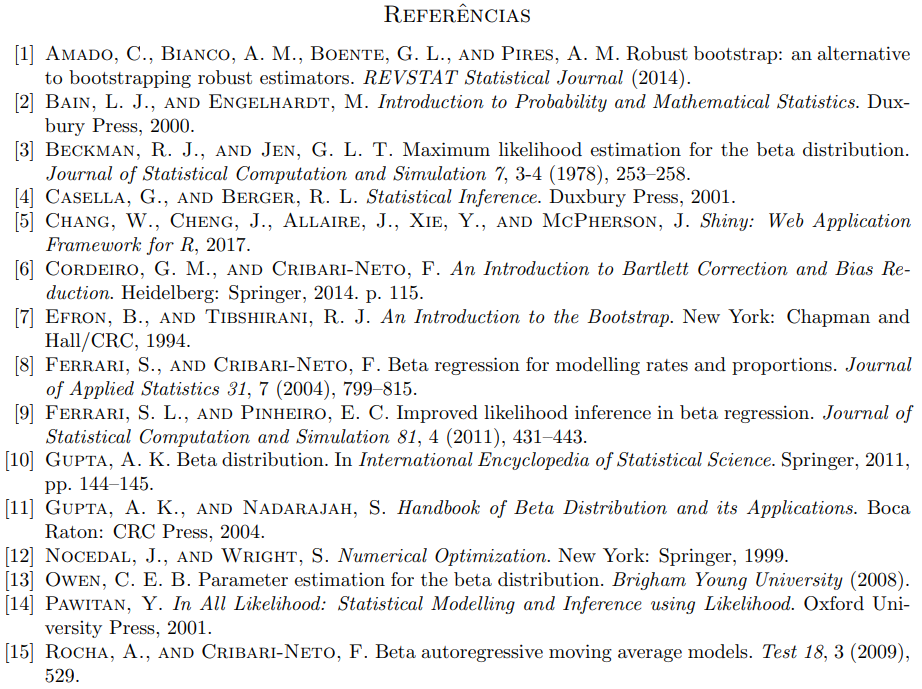

## Correção e avaliação numérica de estimadores para os parâmetros da distribuição beta
Este projeto objetiva avaliar numericamente os estimadores para os parâmetros da distribuição beta.
		 A estimação pontual dos seus parâmetros foi realizada via estimadores usuais utilizando método dos momentos e de máxima verossimilhança incluindo suas respectivas versões corrigidas por *bootstrap*. 
		 Um estudo de simulações de Monte Carlo foi considerado para avaliar o desempenho dos estimadores 
		 em diferente cenários amostrais. 
		 Ainda, com o propósito de mensurar a performance de diferentes linguagens de programação, 
		 comparamos o tempo de execução do programa compilado em `R` e `Ox`. 
		 Os estimadores corrigidos apresentaram menor viés comparativamente 	às suas versões não corrigidas. 
   
   Além disso, foi desenvolvido um aplicativo interativo para viabilizar a aplicação e compreensão do tema. Disponível em https://ufsm.shinyapps.io/app_betamc/
		
### 1. Introdução

No âmbito de distribuições de probabilidade, sabe-se que a distribuição normal é uma das mais relevantes no meio estatístico, tanto em aplicações empíricas quanto teóricas. Contudo, a suposição Gaussiana é restritiva em diversas aplicações, 
particularmente na modelagem de variáveis do tipo taxas e proporções [[9]](#fim), as quais estão limitadas 
a valores contínuos no intervalo $(0,1)$. Com isso,	
	a distribuição beta [[11]](#fim) tem sido amplamente empregada na modelagem de dados duplamente limitados. 
	 Por exemplo,
	em modelos de regressão [[8]](#fim), a média da variável resposta assume distribuição beta e é modelada por meio de uma estrutura de regressão contendo parâmetros desconhecidos, covariáveis e uma função de ligação. 
	No escopo de séries temporais [[15]](#fim) propuseram o modelo beta autorregressivo de médias móveis ($\beta$ ARMA) no sentido de considerar a característica de dados unitários %modelar adequadamente 
	e viabilizar a obtenção de inferências e previsões mais acuradas. 
	O modelo assume distribuição beta para a variável de interesse com suporte restrito ao intervalo unitário e a média condicional é modelada por meio de uma estrutura autorregressiva e de médias móveis que considera a dependência temporal das observações.   Além disso, a distribuição beta é uma escolha bastante flexível pois acomoda densidades assimétricas, simétricas, em forma de jota, jota invertido, entre outras [[8]](#fim). 

 O presente projeto apresenta uma avaliação numérica de estimadores usuais 
	para os parâmetros da distribuição beta. São eles, o estimador via método dos momentos e o estimador de máxima verossimilhança que terão seu desempenho quantificado via simulações de Monte Carlo por medidas de qualidade de estimadores pontuais como viés, erro padrão e erro quadrático médio. Com o intuito de reduzir o viés desses estimadores consideramos correções *bootstrap* [[7]](#fim). 	A reamostragem *bootstrap* baseia-se em um conjunto de métodos que tem por objetivo criar múltiplas pseudoamostras a partir das observações (*bootstrap* não paramétrico) ou de uma distribuição estimada a partir da amostra (*bootstrap* paramétrico). 
	Neste trabalho, foi considerado a segunda abordagem.  Ainda, é realizada uma comparação entre softwares em que mede-se o tempo de processamento e execução dos scripts. 

Além disso, será desenvolvido um aplicativo interativo *open web* em Shiny [[5]](#fim) estruturado na linguagem de programação `R`, contendo diferentes alternativas para avaliação de parâmetros da distribuição beta. O pacote Shiny é de grande
	utilidade pois permite explorar o potencial gráfico e estatístico do `R` através da criação de interfaces
	dinâmicas, interativas e digitais. Destaca-se a acessibilidade no uso de um aplicativo, uma vez que o usuário não necessita de conhecimento prévio em programação para realizar aplicações. 
	
O trabalho organiza-se da seguinte forma. Na Seção 2 apresenta-se a distribuição beta e a estimação pontual de seus parâmetros incluso mais aspectos inferenciais. O procedimento para correção de viés dos estimadores é abordado na Seção 3. A Seção 4 contém
	o estudo de simulação de Monte Carlo e discute os principais resultados do mesmo. Por fim, as considerações finais são dadas na Seção 5.
	

### 2. Distribuição Beta e estimadores usuais 

A distribuição beta é um modelo	probabilístico adequado para modelar uma variável de interesse distribuída de forma contínua  com suporte restrito ao intervalo $(0,1)$.
		Seja $X$ uma variável aleatória com distribuição beta de parâmetros $\alpha$ e $\beta$, 
		isto é $X\sim {\rm Beta}(\alpha,\beta)$. Sua função densidade de probabilidade é dada por  [[10]](#fim):

  $$
		f(x;\alpha,\beta)=\frac{\Gamma(\alpha+\beta)}{\Gamma(\alpha)\Gamma(\beta)}  x^{\alpha-1}  (1-x)^{\beta-1}\text{ ,  } 0 < x < 1,
$$

  em que $\alpha>0$, $\beta>0$ e $\Gamma(\cdot)$ é a função gama. A média e a variância de $X$ são, respectivamente,
	
$$ E(X)=\frac{\alpha}{(\alpha+\beta)} \quad\quad \text{e} \quad\quad Var(X)=\frac{\alpha\beta}{(\alpha+\beta)^2(\alpha+\beta+1)} . $$

A função distribuição acumulada de $X$ é \cite{Gupta2004}:

$$ F(x;\alpha,\beta) = \frac{B(x;\alpha,\beta)}{B(\alpha,\beta)}, $$

em que $B(\cdot,\cdot)$ é a função beta e $B(x;\cdot,\cdot)$ é a função beta incompleta. 
		Dependendo dos valores paramétricos, a densidade beta assume diferentes formas, sendo de grande flexibilidade para modelar proporções.
		
A Figura 1 
		apresenta a função densidade de probabilidade beta com diferentes valores de $\alpha$ e $\beta$. Destaca-se que a mesma pode assumir formas simétricas, assimétricas, em forma de J, de J invertido, entre outras. 		
		

  

A ampla aplicabilidade da distribuição beta se deve ao fato de que grande parte dos dados podem ser expressos como taxas, proporções ou índices. Para modelar os dados por meio da distribuição beta  é necessário realizar a estimativa dos parâmetros $\alpha$ e $\beta$. Contudo, a qualidade das estimativas dependem do método de estimação utilizado. A seguir apresenta-se estimadores tradicionais da inferência estatística. 

  #### 2.1. Estimador via Método dos Momentos (EMM).

  
O EMM é um dos estimadores mais antigos e simples da inferência estatística [[4]](#fim). Para estimação dos parâmetros desconhecidos, o método dos momentos constitui-se em igualar os momentos amostrais da variável aleatória por seus equivalentes momentos populacionais e resolver o sistema de equações simultâneas [[2]](#fim).  Dada uma amostra aleatória ${\bf X}=(X_1,X_2,\ldots,X_n)$,  os EMM para os parâmetros $\alpha$ e $\beta$ da distribuição beta são dados, respectivamente, por [[13]](#fim):

$$
		\begin{align*}
		\bar{\alpha}&=\bar{X} \left( \frac{\bar{X}(1-\bar{X})}{{S^2}}-1 \right),\\
		\bar{\beta}&=(1-\bar{X})\left( \frac{\bar{X}(1-\bar{X})}{S^2}-1 \right),
		\end{align*}
$$

em que 
$\bar{X}= \frac{1}{n} \sum_{i=1}^n X_i ~~$ 
 e
$~S^2 = \frac{1}{n-1} \sum_{i=1}^n (X_i - \bar{X})^2$

  #### 2.2. Estimador de Máxima Verossimilhança (EMV).

  O método da máxima verossimilhança é o método mais popular para estimação de parâmetros, sendo amplamente explorado na literatura [[14]](#fim). Sabe-se que o EMV possui ótimas propriedades como consistência e eficiência assintótica.
		Seja ${\bf x}=(x_1,x_2,\ldots,x_n)$ uma amostra observada. A função de verossimilhança para os parâmetros $\alpha$ e $\beta$ é definida por:

  $$
	\begin{align*}
		L(\alpha,\beta;{\bf x}) &= \prod_{i=1}^n  f(x_i;\alpha,\beta) = \prod_{i=1}^n \frac{\Gamma(\alpha+\beta)}{\Gamma(\alpha)\Gamma(\beta)}  x_i^{\alpha-1}  (1-x_i)^{\beta-1}.
		\end{align*}
$$

Tomando o logaritmo da função de verossimilhança, temos a função de log-verossimilhança, dada por:
  
$$
\begin{align}
		\ell(\alpha,\beta;{\bf x}) &= \sum_{i=1}^n \log [ f(x_i;\alpha,\beta) ] = \sum_{i=1}^n \ell_i (x_i;\alpha,\beta), 
		\end{align}
$$

em que

$$
		\begin{align*}
		\ell_i (x_i;\alpha,\beta) 
		&= \log [ \Gamma(\alpha+\beta) ]  - \log [ \Gamma(\alpha) ] -\log [ \Gamma(\beta) ] \\ 
		&\quad+ \alpha\log(x_i)+\beta\log(1-x_i) - \log(x_i) - \log(1-x_i). 
		\end{align*}
$$

Ao derivar a função de log-verossimilhança em relação à $\alpha$ e $\beta$, obtemos o vetor escore ${\bf U}=(U_\alpha,U_\beta)^\top$, em que

$$
		\begin{align*}
		U_\alpha
		&=\frac{ \partial \ell(\alpha,\beta;{\bf x})} {\partial\alpha} 
		= n [ \psi (\alpha+\beta) ] - n [ \psi (\alpha) ] + \sum_{i=1}^n \log(x_i),\\
		U_\beta
		&=\frac{ \partial \ell(\alpha,\beta;{\bf x})} {\partial\beta} 
		= n [\psi (\alpha+\beta)] - n [ \psi(\beta)] + \sum_{i=1}^n  \log(1-x_i),
		\end{align*}
$$

sendo $\psi(\cdot)$ a função digama, ou seja, $\psi(u) = \frac{\partial \log \Gamma(u)}{\partial u}$, para $u>0$.

Os estimadores de máxima verossimilhança são os valores $\hat{\alpha}$ e $\hat{\beta}$ que maximizam a função de verossimilhança, ou, equivalentemente, a função de log-verossimilhança.
		Para obtenção dos estimadores é preciso calcular o vetor escore e resolver o sistema de equações ${\bf U}={\bf 0}$.		
		Contudo, este não possui solução em forma fechada. Serão considerados métodos numéricos de otimização não linear para maximização da função de log-verossimilhança. 
		Maiores detalhes sobre EMV dos parâmetros da distribuição beta podem ser vistos em [[3]](#fim)}.

### 3. Correção *bootstrap*

Conforme resultados de simulação presentes na Seção 4, verifica-se que os estimadores estudados possuem considerável viés. Apesar de boas propriedades assintóticas, os estimadores de máxima verossimilhança, em geral, são viesados para os verdadeiros valores dos parâmetros sob tamanho amostral pequeno.	
	Por este motivo, 
	métodos de redução de viés podem ser empregados [[6]](#fim). 
	Neste trabalho,
	são utilizadas correções *bootstrap* [[7]](#fim) paramétricas para a redução de viés dos estimadores.  

O método *bootstrap* é um método computacionalmente intensivo que consiste na geração de reamostras a partir da amostra originalmente observada. 
	Essas reamostras podem ser obtidas diretamente a partir das observações (*bootstrap* não paramétrico) ou da distribuição estimada (*bootstrap* paramétrico). 
	Ao utilizar o *bootstrap* não paramétrico, a reamostragem pode ser comprometida quando *outliers* estão presentes no conjunto de dados pois corre-se o risco de reamostrá-los várias vezes e distorcer as estimativas dos parâmetros [[1]](#fim).  
	Por outro lado, o *bootstrap* paramétrico gera pseudoamostras de uma função de distribuição conhecida avaliada nas estimativas dos parâmetros a partir dos dados originais. Objetivando melhores resultados e prevenindo possíveis problemas na reamostragem,
	consideramos o *bootstrap* paramétrico em que as pseudoamostras são realizações da função distribuição beta avaliada nas estimativas dos parâmetros obtidas pelo EMV. 
	Seja $\theta=(\alpha,\beta)^\top$ o vetor paramétrico da distribuição beta e $\widehat{\theta}$ um estimador qualquer de $\theta$.
	A correção *bootstrap* para $\widehat{\theta}$ pode ser descrita da seguinte forma:

1. Estima-se $\theta=(\alpha,\beta)^\top,$ a partir da amostra original obtendo $\hat{\theta}$ ;
2. A partir das estimativas obtidas, geram-se B reamostras *bootstrap* $x^*_b$ sendo elas ocorrências da distribuição Beta $(\hat{\alpha},\hat{\beta})$ com parâmetro $\hat{\theta}$ ;
3. Para cada reamostra *bootstrap* obtém-se as réplicas $\hat{\theta}^*_b$ de $\hat{\theta}$ ;
4. Obtenha uma estimativa *bootstrap* do viés de $\hat{\theta}$, $\hat{B}_\text{boot}(\hat{\theta})=\bar{\theta^*}-\hat{\theta}$ em que
  
$\bar{\theta*}= \frac{1}{B}\sum^B_{b=1} \theta_b*$  ;

5. Por fim, o estimador corrigido por *bootstrap* é dado por $\hat{\theta*}=\hat{\theta}-\hat{B}_{boot}(\hat{\theta})= 2\hat{\theta}-\bar{\theta^*}$ .

Para geração das reamostras *bootstrap* (item 2 no algoritmo) foi testada a utilização de ambos EMM e EMM.  Os melhores resultados foram observados quando gera-se as pseudoamostras pelas estimativas do EMV, portanto, o consideramos no método *bootstrap* paramétrico.

### 4. Resultados

Para avaliar numericamente os estimadores dos parâmetros foi realizado um estudo de simulações de Monte Carlo. As implementações computacionais foram desenvolvidas em linguagem `R` e `Ox` visando a comparação do desempenho destes \textit{softwares}. Foram consideradas $R=5000$ réplicas de Monte Carlo e $B=1000$ reamostras *bootstrap* com tamanhos amostrais $n \in \{30, 50, 100, 500 \}$. No procedimento de maximização da função de log-verossimilhança foi utilizado o método Quasi-Newton BFGS [[12]](#fim) com primeira derivada analítica. Os valores iniciais exigidos pelo algoritmo de otimização foram dados pelas estimativas obtidas pelo método dos momentos, no sentido de acelerar a convergência da função. Fato, este confirmado durante a programação. 
As medidas estatísticas calculadas foram: média, viés, viés relativo percentual (VR), erro padrão e erro quadrático médio (EQM).

 As Tabelas 1 e 2 apresentam, respectivamente, os resultados numéricos da avaliação dos estimadores com parâmetros $\alpha=5$ e $\beta=3$. 
	Como esperado, observa-se semelhança nas estimativas de ambos *softwares*. É notável que os estimadores corrigidos, denotados por $\hat{\theta}\*$ e $\bar{\theta}\*$, fornecem estimativas menos viesadas comparativamente à suas versões não corrigidas em todos tamanhos amostrais tanto em `R` quanto em `Ox`.
	Por exemplo, na Tabela 1 para $n=30$ com o `R`, o VR de $\hat{\alpha}$ foi reduzido de $11.98\%$ para $-0.24\%$ com estimador 
 $\hat{\alpha}\*$
 pelo método *bootstrap*. Exemplificando para o parâmetro $\beta$ na Tabela 2 considerando o `Ox`,  observa-se com $n=50$, o relevante  decréscimo de VR, inicialmente com $5.86\%$  para $\hat{\beta}$ enquanto que sua versão corrigida com VR= $-0.5\%$. Comparando apenas os estimadores corrigidos, constata-se que $\hat{\theta}\*$ apresenta melhor desempenho que $\bar{\theta}\*$. Isso se deve ao fato das reamostras serem geradas da distribuição beta avaliada nas estimativas do EMV.
	Desconsiderando a correção, nota-se que os EMM apresentam desempenho mais adequado em relação aos EMV, pois são menos viesados para os parâmetros $\alpha$ e $\beta$.
	Em relação ao EQM não houve mudanças expressivas, porém percebe-se que conforme a amostra aumenta, há decréscimo no EQM de todos estimadores.
	

  

  

	
A velocidade de processamento dos softwares  `R`  e `Ox` podem ser comparadas na Tabela 3. Lembrando que o número de réplicas de Monte Carlo foi fixado em $R=1000$ e o número de reamostras *bootstrap* em $B=500$. O tempo de execução dos programas foi em todos casos mais lento com a linguagem `R`. Por exemplo, com o menor tamanho amostral $30$, a compilação do script contendo a correção *bootstrap* demorou 24 minutos no `R` enquanto que em `Ox` durou apenas 58 segundos. Desconsiderando o \textit{bootstrap}, observa-se na linguagem `Ox` a execução do programa para todos tamanhos amostrais em menos de 1 segundo. Já no `R`, para $n=500$, a compilação levou 8 segundos. Em uma análise geral, obteve-se desempenho satisfatório em ambos \textit{softwares} quando não há um método computacional intensivo. Porém, a inclusão do método *bootstrap* confirmou a prevalência da linguagem `Ox` no quesito velocidade.

  

### 4. Conclusões

Neste trabalho, foram apresentadas características e propriedades inferenciais da distribuição beta combinado a aplicação do método *bootstrap*. 
	A avaliação numérica dos parâmetros da distribuição demonstrou o comportamento de estimadores usuais e corrigidos em diferentes cenários. Por meio de simulação de Monte Carlo evidenciou-se um desempenho superior dos estimadores corrigidos por *bootstrap* comparativamente às respectivas versões não corrigidas pois o viés das estimativas foi acentuadamente reduzido.	
	Dessa forma, visto sua eficácia, recomenda-se o uso do método *bootstrap* para correção tratando-se da estimação dos parâmetros da distribuição beta, principalmente em tamanhos amostrais pequenos.
 
 A velocidade de processamento entre os \textit{softwares} `R` e `Ox` foi destacadamente grande. `Ox` foi mais rápido na compilação dos programas. Ainda, um aplicativo foi desenvolvido em `R Shiny` para possibilitar maior acessibilidade ao uso da estatística computacional. Para acesso: https://ufsm.shinyapps.io/app_betamc/
	

 
 
 

  

